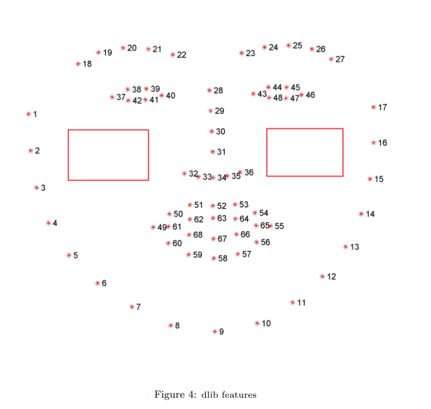
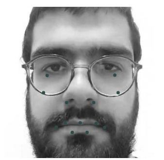

# Face_Recognition_Smile_Pattern

Face recognition is the problem of identifying and verifying people in a photograph by their face. Since every Smile is [Unique](https://arxiv.org/abs/1802.01873), in this project an attemp is made to propose Smile Pattern as a new biometric trait for face recognitionuse task. In this project we extract dlib facial landmarks and track their movements during video frames using optical flow. Finally, by using curve fitting we extract the coefficients of each landmark. Project steps are as follows:

### 1) Video Stabilization

Since in our methodologies we are using optical flow, we need stable videos. Since most of the face recognition dataset videos are taken in undercontrolled setting, we must use stabilization approaches to remove unwanted noises and movments to have an smooth video. 

### 2) Face Detection using Har Cascade

Haar Cascade is a machine learning object detection algorithm proposed by Paul Viola and Michael Jones. In this project  we used Haar Cascade method to extract the face in the first frame of video. In order to detect smile in video frames, we used CNN based facial expression tools.

### 3) Smile Detection Using CNN

Since the video might not include a smile, we need to check whether the person smile or not. Therefore, we have used a pretrained CNN based model to count the number of frames containing smile. We calculate the facial expression for each frame and count the number of frames with happy tags. If the number of happy frames is greater than 0.2 of all frames, we conclude that the person has smile during the video and the smile pattern could be extracted.

### 4) Facial Feature Extraction

Dlib library could extract 68 facial landmarks in an image. The landmarks that we are interested in, are the one that describes the shape of the face attributes like: eyes, eyebrows, nose, mouth, and chin (13 in totall). You must download shape_predictor_68_face_landmarks.dat and put it in Code folder to make the code work. You can download this file from [here](https://github.com/italojs/facial-landmarks-recognition)




### 5) Optical Flow and Landmarks Tracking

In this project, we have selcted 13 landmarks, therefore we will have 13 patterns. Optical flow gives us how the position of a point changes during video
sequences. So we will have 13 patterns belonging to a person. Combination of these patterns would make a unique smile pattern. It worth to mention that
we must tune the hyperparameters of lulas-kanade algorithms. The optimal value for parameters in this investigations are winSize=(40, 40), maxLevel=5, criteria=(5, 0.001)

### 6) Curve Fitting

After extracting landmarks by Dlib library in the first frames we must record the movement of this points by using optical flow.Therefore, we will have
13 set of points which each of them has points equal to the number of frames. Now we have set of points which we want to fit a function on these set of points. In this step we have used Curve fitting to fit a polynomial on our data. The degree of the polonial is five.

### 7) one vs all classification

The result of the previous steps is a CSV file containing coefficients for differnt landmarks and for different people in all videos. The generated csv must be feed into a 
one vs all classificatier like Support Vector Machine or Naive Bayes.

## Dataset

Since there is not any dataset for this task, an attempt is made to make a dataset. The dataset consists of 12 people each has 4 videos. We use three of videos for training and one for testing purposes. A sampel of dataset can be seen Training_Data folder. In case you need the full data you can directly contact me via email.

email: kamel.1911242@studenti.uniroma1.it

## Test the code

You must download shape_predictor_68_face_landmarks.dat from [here](https://github.com/italojs/facial-landmarks-recognition) and put it in Code folder. 
```
cd Code
python Learning_Algorithm.py
```
After generating the Train1.csv from the previous step, use any one vs all classifier to test the accuracy of the model.

## Model Accuracy

We got the accuracy of 65 percent using Support Vector Machine.
